# Actividad 4: API REST Pura con Spring Security & JWT — Desplegada en VPS 


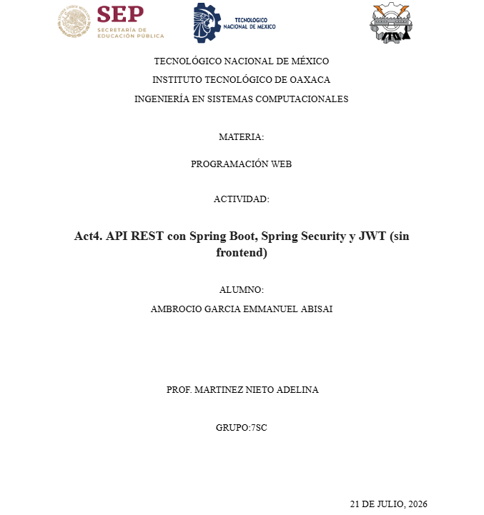

---

## 1. Descripción del Proyecto

Esta actividad consiste en una API REST pura construida con Spring Boot, sin vistas Thymeleaf, con autenticación real mediante **Spring Security + JWT**. Conecta con lo desarrollado en las Actividades 2 y 3 (DTOs, Entity, Repository, Service, relaciones JPA), agregando ahora una capa de seguridad completa.

El CRUD implementado gestiona una entidad de **Videojuegos**, protegida por completo detrás de un filtro de autenticación JWT: nadie puede acceder a los endpoints del CRUD sin antes registrarse e iniciar sesión para obtener un token válido.

---

## 2. Arquitectura de Red y Despliegue en el VPS

La aplicación está empaquetada como un `.jar` ejecutable y corriendo en un **VPS (Virtual Private Server)** con IP pública, en un puerto exclusivo para esta actividad, sin afectar las Actividades 1, 2 y 3 que corren simultáneamente en el mismo servidor.

* **Host del Servidor VPS:** `18.188.66.230`
* **Puerto asignado a esta actividad:** `8088`
* **Otros puertos activos en el mismo VPS (sin afectar):** 8081 (Act 1), 8083 (Act 2), 8085 (Act 3)

### Flujo de comunicación:

```
Cliente Externo (Bruno) 
      ⬇  HTTP sobre Internet
Puerto 8088 del VPS (18.188.66.230)
      ⬇
Spring Boot Application (Spring Security + JWT)
      ⬇
Base de Datos (conexión interna del VPS)
```

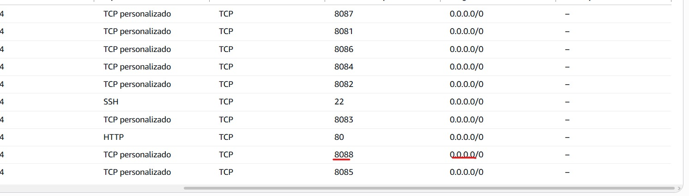

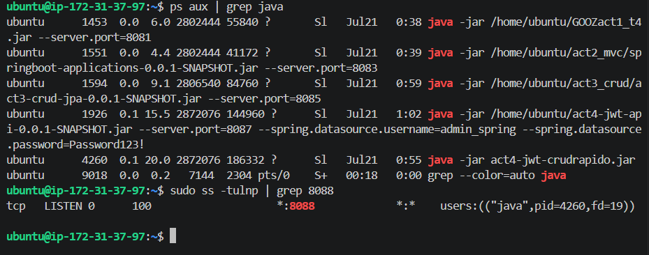

---

##  3. Endpoints Disponibles

Todos los endpoints devuelven y reciben datos exclusivamente en formato **JSON**.

|  | Operación | Método | Endpoint | Acceso |
|---|---|---|---|---|
| 1 | Registrar Usuario | `POST` | `http://18.188.66.230:8088/api/auth/register` |  Público |
| 2 | Iniciar Sesión (Login) | `POST` | `http://18.188.66.230:8088/api/auth/login` |  Público |
| 3 | Listar Videojuegos | `GET` | `http://18.188.66.230:8088/api/v1/videojuegos` |  Protegido (JWT) |
| 4 | Crear Videojuego | `POST` | `http://18.188.66.230:8088/api/v1/videojuegos` |  Protegido (JWT) |
| 5 | Actualizar Videojuego | `PUT` | `http://18.188.66.230:8088/api/v1/videojuegos/{id}` |  Protegido (JWT) |
| 6 | Eliminar Videojuego | `DELETE` | `http://18.188.66.230:8088/api/v1/videojuegos/{id}` |  Protegido (JWT) |
| 7 | Prueba sin Token | `GET` | `http://18.188.66.230:8088/api/v1/videojuegos` |  Debe rechazar (403) |

---

##  4. Flujo de Pruebas y Evidencias (Bruno)

Todas las pruebas se realizaron desde **Bruno**, apuntando directamente a la IP pública del VPS (no a localhost), confirmando que la API es accesible desde cualquier cliente externo por internet.

### Paso 1 — Registro de Usuario

* **Endpoint:** `POST http://18.188.66.230:8088/api/auth/register`
* **Descripción:** El controlador recibe el DTO de registro, la contraseña se guarda encriptada (hash) y se persiste el nuevo usuario en la base de datos.
* **Body:**
```json
{
  "username": "bruno_test1",
  "password": "Password123!"
}
```

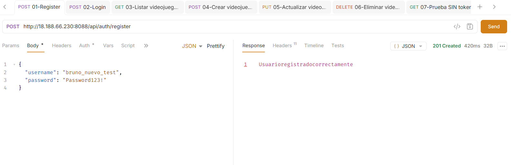

---

### Paso 2 — Login (obtención del token)

* **Endpoint:** `POST http://18.188.66.230:8088/api/auth/login`
* **Descripción:** Se validan las credenciales contra la base de datos. Si son correctas, se genera y regresa un token JWT firmado, que se usará en todos los endpoints protegidos.
* **Body:**
```json
{
  "username": "bruno_test1",
  "password": "Password123!"
}
```

![alt text]img/image-4.png)

---

### Paso 3 — Listar Videojuegos (con token)

* **Endpoint:** `GET http://18.188.66.230:8088/api/v1/videojuegos`
* **Header:** `Authorization: Bearer <TOKEN_DEL_PASO_2>`
* **Descripción:** Petición protegida. El filtro de seguridad valida el token antes de dejar pasar la petición al controller. Regresa la lista de videojuegos existentes.

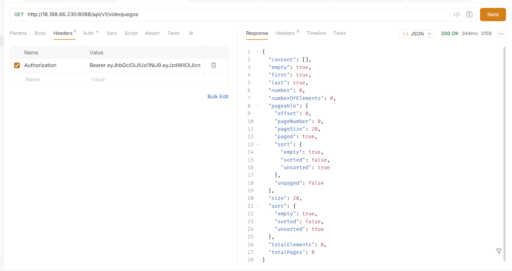

---

### Paso 4 — Crear Videojuego

* **Endpoint:** `POST http://18.188.66.230:8088/api/v1/videojuegos`
* **Header:** `Authorization: Bearer <TOKEN_DEL_PASO_2>`
* **Descripción:** Crea un nuevo registro. Los datos se validan mediante `@Valid` y anotaciones de Bean Validation en el DTO antes de guardarse.
* **Body:**
```json
{
  "titulo": "[ajustar a tu VideojuegoDTO]",
  "genero": "[ajustar]",
  "anioLanzamiento": 2021
}
```

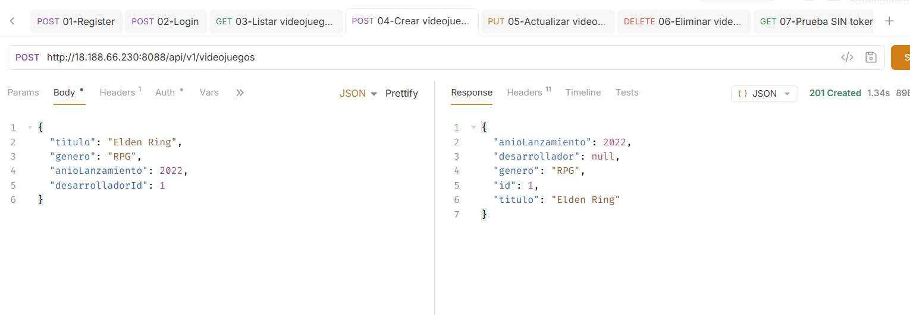

---

### Paso 5 — Actualizar Videojuego

* **Endpoint:** `PUT http://18.188.66.230:8088/api/v1/videojuegos/{id}`
* **Header:** `Authorization: Bearer <TOKEN_DEL_PASO_2>`
* **Descripción:** Actualiza el recurso indicado por ID. Regresa 200 OK si el recurso existe y se actualiza correctamente.
* **Body:**
```json
{
  "titulo": "[titulo actualizado]",
  "genero": "[ajustar]",
  "anioLanzamiento": 2022
}
```

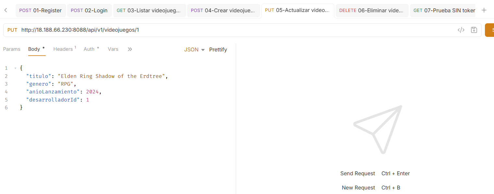

---

### Paso 6 — Eliminar Videojuego

* **Endpoint:** `DELETE http://18.188.66.230:8088/api/v1/videojuegos/{id}`
* **Header:** `Authorization: Bearer <TOKEN_DEL_PASO_2>`
* **Descripción:** Elimina el registro indicado. Regresa 204 No Content al completarse.

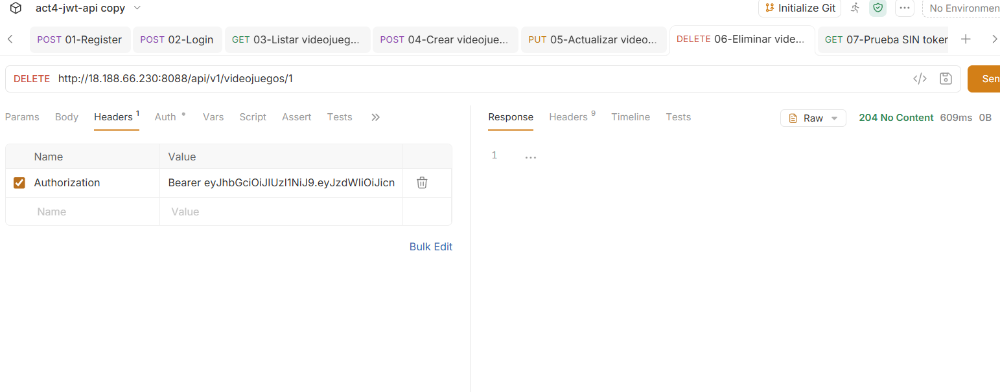

---

### Paso 7 — Prueba sin Token (validación de seguridad)

* **Endpoint:** `GET http://18.188.66.230:8088/api/v1/videojuegos`
* **Header:** Ninguno (sin `Authorization`)
* **Descripción:** Petición sin token, simulando un intento de acceso no autorizado. El filtro `SecurityFilterChain` de Spring Security intercepta la petición antes de que llegue al controller y la rechaza con un código 401/403.

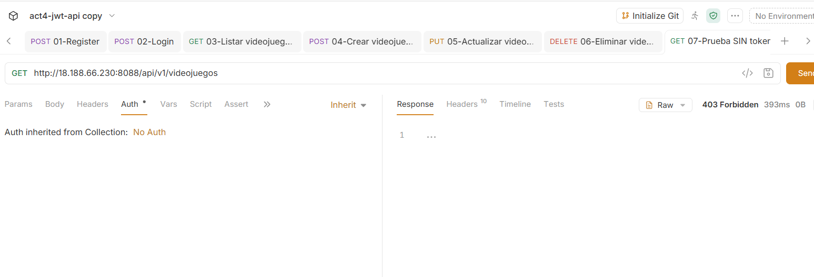

---

##  5. Verificación en la Base de Datos

Para confirmar que los datos realmente se están persistiendo (y no solo respondiendo en memoria), se ingresó directamente al gestor de base de datos del VPS vía SSH.

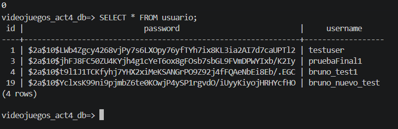

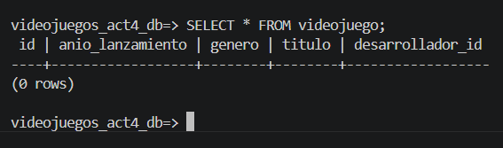

---

##  6. Colección de Bruno

La carpeta [`/bruno`](./bruno) en la raíz de este repositorio contiene los archivos `.bru` de todas las peticiones documentadas arriba, en formato de texto plano versionable. Puede importarse directamente en Bruno para repetir todas las pruebas contra el VPS.

---

## Enlaces


* **Repositorio de GitHub:** `https://github.com/EmmaAbisa/AGEAact4_t4`
* **API funcionando en el VPS:** `http://18.188.66.230:8088`

---
